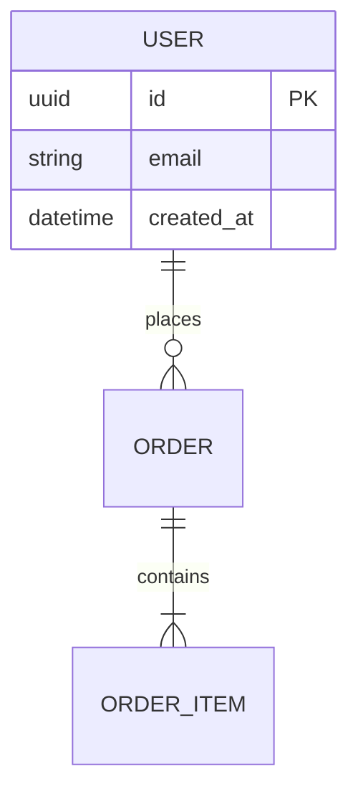

# Skill: design-data-model

## Purpose
Produce a storage-neutral entity-relationship model that captures every persisted concept implied by the requirements. The output seeds `write-data-contracts`; entity and field names defined here are binding for downstream JSON Schema.

## When to invoke
Invoke during architecture phase, once requirements are stable, before component or API contracts are written. Do NOT invoke to: add a single column to an existing table (use a migration skill), define DTOs (those belong to API contracts), or design caches/indices (storage-specific).

## Procedure (follow exactly)
1. List every business concept named or implied by requirements. One entity per concept; do not merge unrelated concepts.
2. For each entity, list attributes with primitive types only (`string`, `int`, `float`, `bool`, `datetime`, `uuid`). No ORM types, no `varchar(255)`, no `BIGINT`.
3. Mark exactly one primary key per entity (`PK`). Mark every foreign key (`FK`) with the target entity.
4. Define relationships using ER cardinality (`||--o{`, `||--||`, `}o--o{`). Name the relationship verb (e.g. `places`, `owns`).
5. Defer validation rules (regex, range, enum) to `write-data-contracts`; record them only in the notes list, not in the diagram.
6. Output one Mermaid `erDiagram` block plus a short notes list.

## How to think
- Junction tables only when a many-to-many has its own attributes.
- Soft-delete flags belong in data contracts, not the ER diagram.
- Audit fields (`created_at`, `updated_at`) belong in every entity but should be added consistently via the notes list, not repeated by hand.
- Do not invent entities to make a diagram look richer.

## Required inputs
`requirements` must include at least one functional requirement that implies persistence. If only stateless features are described, STOP — there is no data to model.

## Output format

Plus: `notes: ["all entities carry created_at/updated_at", "Order.status enum deferred to data contracts"]`.

## Quality criteria
Passes if: every entity has a PK; every FK targets an existing entity; cardinality declared on every relationship; only primitive types; one entity per business concept.
Fails if: ORM-specific syntax leaks in; relationships drawn without cardinality; same concept split across two entities; validation rules embedded in the diagram.

## Common pitfalls
- Modeling join tables that don't need to exist.
- Using `varchar` or `decimal(10,2)` instead of `string`/`float`.
- Conflating `User` and `Account` when the PRD treats them separately.
- Forgetting cardinality, leaving relationships ambiguous.

## Examples
Good: 4 entities, 3 relationships with verbs, every PK marked, notes list defers enums.
Bad: storage-specific types; missing PK on a child entity; relationship with no cardinality.

## Stop condition
A valid `erDiagram` block exists with PKs, FKs, cardinality, and primitive types only; notes list captures deferred validation; entity names are ready to be reused verbatim in data contracts.

## Confidence guidance
Lower when: PRD is vague on persisted state (≤0.75), many-to-many relationships need junction tables that aren't obvious (≤0.8), audit/soft-delete requirements unstated (≤0.8), entities cross domain boundaries (≤0.7). Need ≥0.85.
