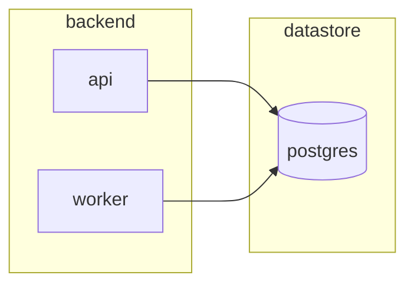

# Skill: generate-architecture-diagram

## Purpose
Render the system as a Mermaid `flowchart` showing every component and every directed dependency. The diagram is the visual contract that the TSD's Component Contracts section refers to; nodes and edges must match component names exactly.

## When to invoke
Invoke when the plan asks for an architecture diagram AND a `components` list is already produced (by design-data-model + select-tech-stack). Do NOT invoke to: draw sequence flows (out of scope), illustrate database schema (use erDiagram via design-data-model), or sketch UI wireframes.

## Procedure (follow exactly)
1. Parse `components`. Reject duplicates by name.
2. Pick a layout direction: `LR` if dependency depth ≤ 3, otherwise `TB`.
3. Emit one node per component, id = sanitized name (alnum + underscore), label = exact name.
4. For each `depends_on[i]`, emit an edge from the dependent to the dependency: `A --> B`.
5. Group nodes into subgraphs by role (e.g. `frontend`, `backend`, `datastore`, `external`) when ≥ 3 components share a role.
6. Output ONLY a fenced ```mermaid block. No headings, no explanation, no trailing text.

## How to think
- Match TSD component names character-for-character. Renaming here breaks cross-references.
- External services (Stripe, Auth0) get their own `external` subgraph.
- Bidirectional dependency is almost always a modeling error; STOP and ask human.
- Do not invent components not in the input list.

## Required inputs
`components` must be non-empty and every `depends_on` reference must point to a name in `components`. If a reference is dangling, STOP — the architecture is incomplete.

## Output format


## Quality criteria
Passes if: every component is a node; every depends_on is an edge; node labels equal component names; no orphan node unless explicitly standalone; valid Mermaid syntax.
Fails if: nodes appear that are not in input; edges point to undefined nodes; prose outside the fence; multiple diagrams emitted.

## Common pitfalls
- Adding "user" or "browser" nodes that are not in the component list.
- Drawing implicit edges (e.g. "everything reaches the db") instead of explicit ones.
- Using fancy shapes for emphasis; stick to default rectangles + cylinder for datastores.
- Forgetting to sanitize ids that contain dashes or spaces.

## Examples
Good: 6 components, 4 edges, 2 subgraphs, valid Mermaid that renders.
Bad: free-text prose explaining the diagram; node names with spaces breaking parsing; invented "load balancer" node not in input.

## Stop condition
A single valid `mermaid flowchart` block exists, every input component appears, every dependency is rendered as an edge, and no extra prose accompanies the diagram.

## Confidence guidance
Lower when: component list has ambiguous roles (≤0.8), bidirectional dependencies exist (≤0.7), >15 components (≤0.8 — readability suffers), dangling references repaired by guess (≤0.6). Need ≥0.85.
